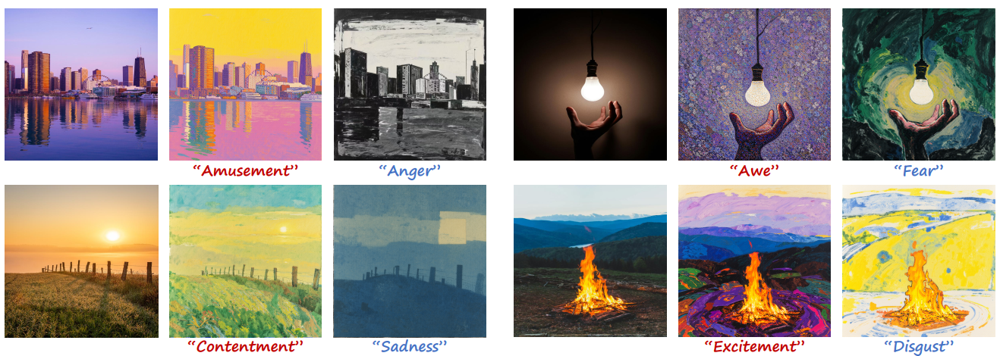
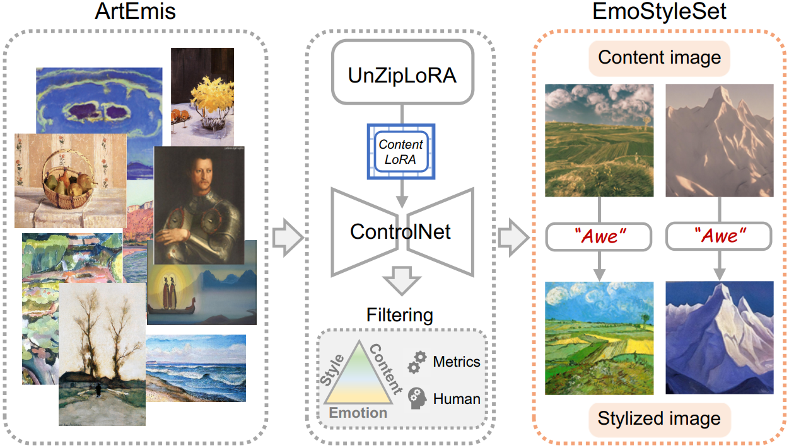
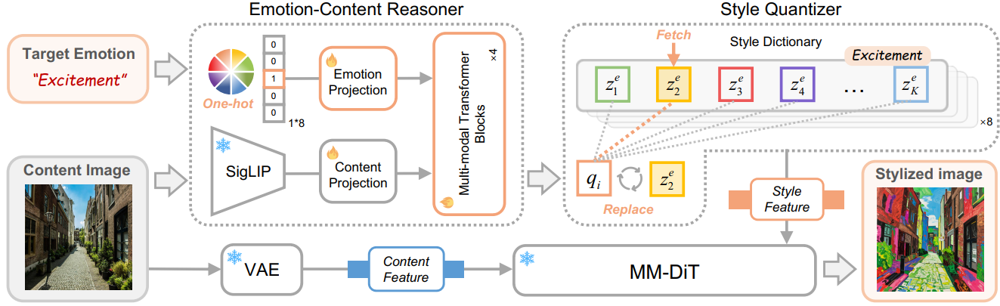
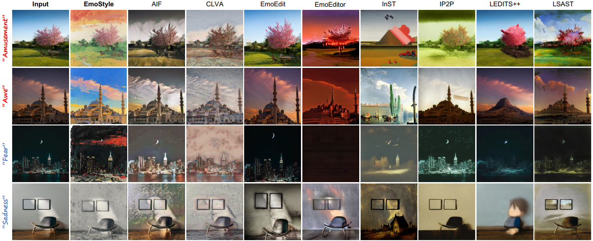
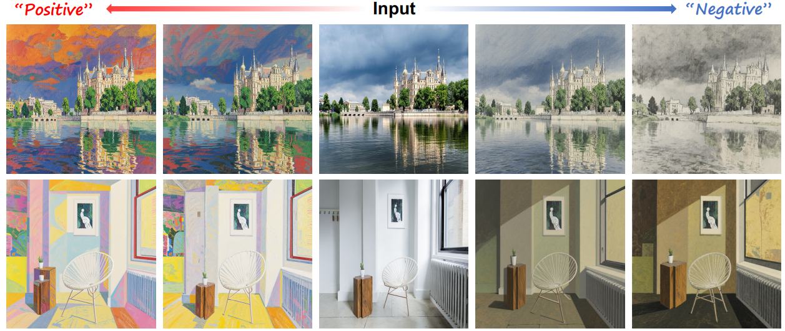
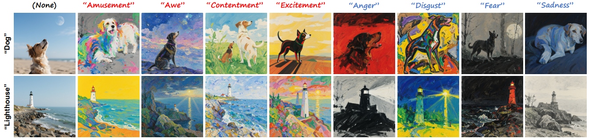

# EmoStyle: Emotion-Driven Image Stylization (CVPR 2026)
> [Jingyuan Yang](https://jingyuanyy.github.io/)<sup>1</sup>, Zihuan Bai<sup>1</sup>, [Hui Huang](https://vcc.tech/~huihuang)<sup>1</sup><sup>*</sup>  
> <sup>1</sup>Shenzhen University<br>
> Affective Image Stylization (AIS) aims to stylize user-input images to match the desired emotion. This task is inherently challenging due to the complex mapping between emotions and visual styles to evoke the desired emotional response.


<p align="left">
  
<br>
Fig 1. Affective Image Stylization with EmoStyle, aiming to transform user-provided images through artistic stylization to evoke specific
emotional responses. It requires only emotion words as prompts, eliminating the need for reference images or detailed text descriptions.
</p>


## Preliminary
You can download the pretrained EmoStyle models from [here](https://huggingface.co/lilwhit3/EmoStyle).

<p align="left">
  
<br>
Fig 2. Construction process of EmoStyleSet. Given artworks from ArtEmis, after generation and filtering, each triplet contains a content image, a target emotion, and a stylized image.
</p>

Other pretrained models like SigLIP, USO can be found in the [Hugging Face Model Hub](https://huggingface.co/models).

## Quick Start

### Requirements

```bash
git clone https://github.com/JingyuanYY/EmoStyle.git
cd EmoStyle
```

Install the requirements
```bash
conda create -n emostyle python=3.9 -y
conda activate emostyle

## install torch
## recommended version:
pip install torch==2.4.0 torchvision==0.19.0 --index-url https://download.pytorch.org/whl/cu124

pip install -r requirements.txt
```

## EmoStyle

<p align="left">
  
<br>
Fig 3. Overview of EmoStyle. We introduce an Emotion–Content Reasoner to integrate emotion and content features, and a Style Quantizer to map continuous queries to discrete style prototypes, generating stylized images with faithful emotion and preserved content.
</p>

### Inference
Please make sure the pretrained models are downloaded and put them in the `weights` folder.
And you can specify the checkpoint path, emotion, and save path by modifying arguments in `inference_emostyle.py` or add arguments in the command line.

```bash
python inference_emostyle.py --eval_json_path "path-to-your-inference-json"
```

### Training
Your can choose to train EmotionContentReasoner or StyleQuantizer by specifying the `--optimize_target` argument with
'transformer' or 'codebook'.
And before training, please make sure the EmoStyleSet and specify the `--emotion` argument with the emotion you want to train.
```bash
accelerate launch train_emostyle.py --json_file "path-to-training-json"
```

## Results
### Qualitative Results

<p align="left">
  
<br>
Fig 4. Comparison with the state-of-the-art methods, where EmoStyle surpasses others on emotion fidelity and aesthetic appeal.
</p>

### Quantitative Results

<div align="center">
     
Table 1. Comparisons with the state-of-the-art methods on style transfer, image editing and AIM methods.
| Method | CLIP &uarr; | DINO &uarr; | SG &darr; | Emo-A &uarr; | SD &darr; |
|:-------:|:-------:|:-------:|:-------:|:-------:|:-------:|
| LSAST      | 0.551 | 0.747 | 2.231 | 12.50 | 11.28  |
| CLIPStyler | 0.709 | 0.769 | 3.001 | 12.60 | 19.89  |
| InST       | 0.569 | 0.679 | <u>2.016</u> | 21.22 | 11.48  |
| OmniStyle  | 0.710 | <u>0.813</u> | 2.615 | 12.80 | 11.90  |
| IP2P       | 0.708 | 0.729 | 3.459 | <u>24.34</u> | 12.76  |
| LEDITS++   | 0.687 | 0.807 | 2.637 | 15.97 | 13.11  |
| EmoEditor  | 0.686 | 0.761 | 2.744 | 14.88 | 13.65  |
| EmoEdit    | 0.597 | 0.545 | 2.245 | 12.60 | 28.83  |
| CLVA       | **0.727** | 0.789 | 2.030 | 14.99 | 9.49  |
| AIF        | 0.712 | 0.780 | 2.625 | 12.99 | 8.48  |
| EmoEdit    | <u>0.718</u> | **0.842** | **1.976** | **33.36**| **7.59**  |

</div>

<div align="center">

Table 2.  User preference study. The numbers indicate the percentage of participants who vote for the result.
| Method | Aesthetic Perception &uarr; | Emotion fidelity &uarr; | Balance &uarr; |
|:-------:|:-------:|:-------:|:-------:|
| CLVA | 8.50±12.13% | 0.81±2.16% | 1.19±7.07% |
| InST | 2.50±4.86% | 29.63±2.56% | 1.34±5.53% |
| AIF | 9.08±9.42% | 5.09±2.22% | 7.76±9.91% |
| EmoEdit | **79.92±21.24%** | **64.47±4.55%** | **89.70±14.48%** |

</div>

As shown in Fig.5, you can adjust the guidance scale to achieve different results.

<p align="left">
  
<br>
Fig 5. Ablation study on image guidance scale. EmoStyle can progressively edit an image towards different emotional polarities.
</p>

You can also use textual descriptionsto achieve emotion-aware text-to-image generation.

<p align="left">
  
<br>
Fig 6. EmoStyle can be extended to emotion-aware text-to-image generation, producing semantically faithful, emotionally expressive and aesthetically appealing stylized results.
</p>

## Citation
If you find this work useful, please kindly cite our paper:
```
@article{yang2025emostyle,
  title={EmoStyle: Emotion-Driven Image Stylization},
  author={Yang, Jingyuan and Bai, Zihuan and Huang, Hui},
  journal={arXiv preprint arXiv:2512.05478},
  year={2025}
}
```
